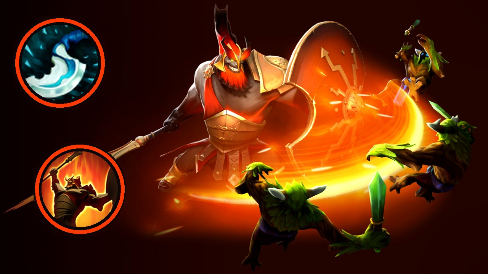

# ytupload

Upload gameplay videos to YouTube with **resumable uploads** and metadata worth reading.

Built for NVIDIA ShadowPlay captures of Dota 2 offlane games, but nothing here is
Dota-specific except one optional preset.

## Why not just use YouTube Studio

- **Resumable, chunked uploads.** Multi-gigabyte captures survive a dropped
  connection; re-running the same command continues where it stopped.
- **Metadata from the command line**, so a script or an assistant can write a real
  title, description, chapters and tags instead of a capture timestamp.
- **No duplicate uploads.** Completed uploads are recorded and skipped.
- **Playlists and thumbnails** handled in the same run, including generating a
  thumbnail from a frame of the video itself.
- **Short clips filtered out** by duration, and uploaded files moved aside.

## Example



Built from official hero artwork with two ability badges. The accent colour is
sampled from the art, so every hero themes itself. See
[docs/examples](docs/examples/) — the Dota 2 artwork is Valve's and is not
covered by this repository's MIT license.

## Setup

### 1. Google Cloud project

1. Create a project at <https://console.cloud.google.com/>.
2. Enable **YouTube Data API v3**.
3. Under *APIs & Services → Credentials*, create an **OAuth 2.0 Client ID** of type
   **Desktop app**.
4. Download the JSON and save it as `secret/secret.json`.

You do not need to register a redirect URI. The tool binds a random loopback port,
which desktop-app credentials accept — this is what avoids the `redirect_uri_mismatch`
error.

### 2. Install

```bash
python -m venv .venv
.venv/Scripts/activate        # Windows
# source .venv/bin/activate   # macOS / Linux
pip install -e .
```

Requires Python 3.9 or newer. `ffmpeg` is installed automatically as a Python wheel
(`imageio-ffmpeg`), so no system install or admin rights are needed; a system `ffmpeg`
on `PATH` is preferred if you have one.

### 3. Authorize

```bash
python -m ytupload auth
```

A browser window opens once. On success it prints your channel name and writes
`token_youtube_v3.json`. Confirm your account can upload at
<https://www.youtube.com/verify>.

## Usage

### One video

```bash
python -m ytupload upload "C:\Users\CHEN\Videos\NVIDIA\Dota 2\Dota 2 2026.09.25 - 21.59.04.14.mp4" \
  --title "Centaur Offlane vs Timbersaw - 41 Minute Comeback | Dota 2 Pos 3" \
  --description-file description.md \
  --tags "Centaur Warrunner,Timbersaw,comeback" \
  --preset dota-offlane \
  --dry-run
```

`--dry-run` validates everything and prints the exact request without uploading. It
needs no credentials and costs no quota. **Drop it to upload for real.**

> Privacy defaults to `public`. Use `--privacy unlisted` or `--privacy private` to stage
> a video instead of publishing it.

### A folder

```bash
python -m ytupload batch "C:\Users\CHEN\Videos\NVIDIA\Dota 2" --preset dota-offlane
```

Skips anything already uploaded, stops at the daily quota, and keeps going if one
video fails. Titles fall back to the filename, so prefer `upload` when the title
matters.

### Cutting a long match

```bash
# Print the plan without rendering
python -m ytupload cut "<video>" --target-minutes 25 --dry-run

# Render to '<name> - cut.mp4'
python -m ytupload cut "<video>" --target-minutes 25
```

Keeps the laning phase whole (`--lane-minutes`, default 10) and reduces the rest
to its most eventful moments, using audio loudness relative to a rolling baseline
plus changes in the on-screen kill counters. Game start is detected from the HUD,
so the pre-game and the post-game screens are dropped.

The target is a cap rather than a quota: a quiet match yields a shorter video, not
one padded out to length. Encoding uses NVENC when available.

### Frames and thumbnails

Neither command needs credentials or costs quota.

```bash
# Extract stills: the post-game scoreboard, a midgame moment, and the laning stage
python -m ytupload frames "<video>"

# Build a 1280x720 thumbnail from a frame of the video
python -m ytupload thumbnail "<video>"   --headline "Centaur Warrunner"   --subtitle "Offlane vs Timbersaw"   --won --at 1320
```

`frames` also prints the duration.

`thumbnail` has two modes. **Hero art** (`--hero`) downloads the official render from
Valve's CDN, caches it, and themes the background from the art's own colours; it needs
no video and cannot reveal the match result. **Frame mode** uses a still from the
video, cropping the game HUD away so the text sits over gameplay.

Neither mode can encode the result: there are no win/loss options, and frame mode
refuses stills from the last 20% of a match, since the ending gives the outcome away.

### Useful options

| Option | Purpose |
|---|---|
| `--description-file` | Read the description from a file. Preferred: descriptions are long and multi-line. |
| `--preset dota-offlane` | Adds offlane tags, the `Dota 2 - Offlane` playlist, and a description footer. |
| `--playlist "Name"` | Add to a playlist, creating it if absent. |
| `--thumbnail path.jpg` | Set a custom thumbnail (requires a verified account). |
| `--brand-image path.png` | Channel mascot, bottom-right corner of the thumbnail. |
| `--archive` | Move the file into an `uploaded/` subfolder once the upload succeeds. |
| `--min-duration` | (`batch`) Skip captures shorter than N seconds. Default 600. |
| `--privacy` | `public` (default), `unlisted`, or `private`. |
| `--notify` | Notify subscribers. Off by default. |
| `--dry-run` | Rehearse without uploading or authenticating. |

## Quota

A default project gets **10,000 units per day**. An upload costs **1,600**, so about
**6 uploads per day**; playlist and thumbnail calls cost 50 each. Past that the API
returns 403 until the quota resets at midnight Pacific.

## Files it writes

| File | Contents | Committed? |
|---|---|---|
| `secret/secret.json` | OAuth client secret | No |
| `token_youtube_v3.json` | Your credentials | No |
| `uploaded_files.txt` | Completed uploads, tab separated | No |
| `.upload_sessions.json` | In-progress resumable sessions | No |

All four are git-ignored. Never commit them.

## Layout

```
src/ytupload/
  metadata.py    what is being uploaded, and its validation
  shadowplay.py  parsing NVIDIA capture filenames
  tracker.py     what has been uploaded, and what is half-uploaded
  auth.py        OAuth2
  uploader.py    resumable upload, playlists, thumbnails
  presets.py     reusable metadata defaults
  video.py       duration probing and frame extraction (ffmpeg)
  editor.py      highlight detection and cutting (ffmpeg, NVENC)
  thumbnail.py   composing a thumbnail from hero art or a frame (Pillow)
  splash.py      full-bleed hero layout with circular item badges
  heroart.py     fetching and caching official Dota 2 hero renders
  archive.py     moving uploaded captures aside
  cli.py         command-line interface
```

## Tests

```bash
pip install pytest
pytest
```

The suite covers metadata validation, filename parsing, and persistence. It performs
no uploads and needs no credentials.

## License

MIT. See [LICENSE](LICENSE).
